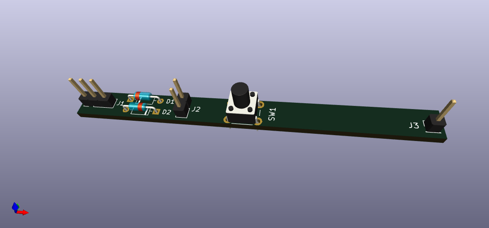

This small PCB board connects a pushbutton switch and an off-board switch as part of a larger matrix. 

:warning: The files embodied in this repository are provided to you "as-is" and without warranty of any kind, express, implied or otherwise, including without limitation, any warranty of fitness for a particular purpose.

